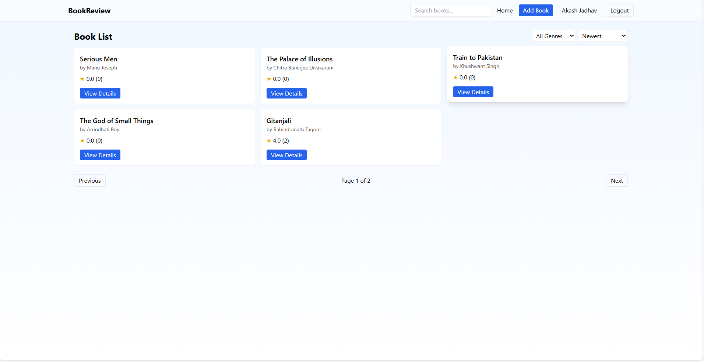
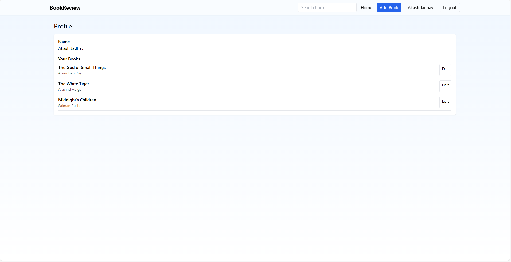
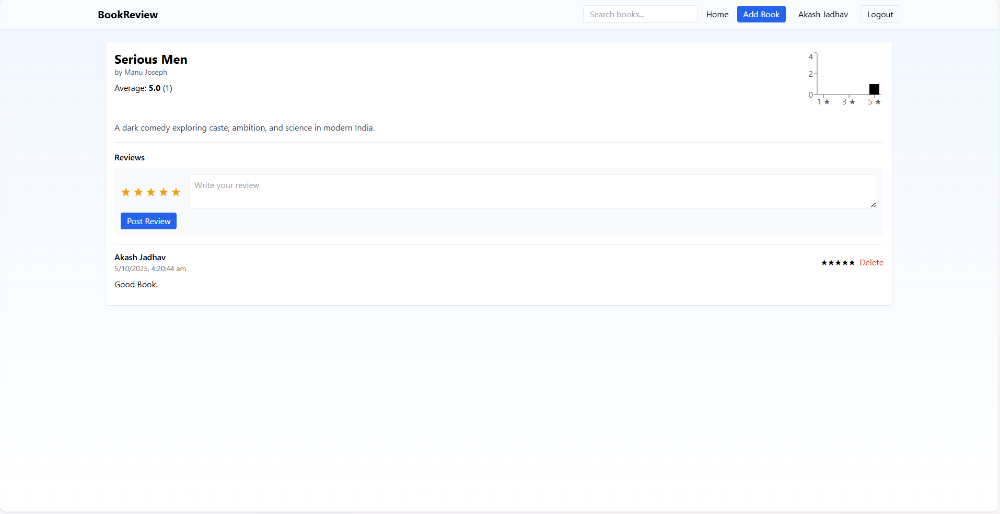

# 📚 Book Review Platform

A **MERN stack web application** where users can add books, post reviews, and rate them.  
Built with **MongoDB Atlas, Express.js, React, and Node.js**, with authentication and authorization.  

---

## 🚀 Features
- 🔑 **User Authentication** (Signup, Login, JWT-based auth)  
- 📖 **Book Management** (Add, Edit, Delete books)  
- ⭐ **Reviews & Ratings** (Each user can review a book only once)  
- 👤 **Profile Page** to manage user activity  
- 🎨 **Responsive UI** with React + Tailwind CSS  
- ☁️ **MongoDB Atlas Integration**  

---

## 📦 Installation & Setup

### Backend Setup
```bash
cd backend
npm install
```

Create a `.env` file inside `backend/`:
```
MONGO_URI=your-mongodb-atlas-uri
JWT_SECRET=your-secret-key
PORT=5000
```

Start backend:
```bash
npm run dev
```

### Frontend Setup
```bash
cd ../frontend
npm install
npm start
```

---

## 📷 Screenshots

### Home Page  
  

### Profile Page  
  

### Book Details with Reviews  
  

---

## 🤝 Contributing
Pull requests are welcome.  
For major changes, please open an issue first to discuss what you’d like to change.  
